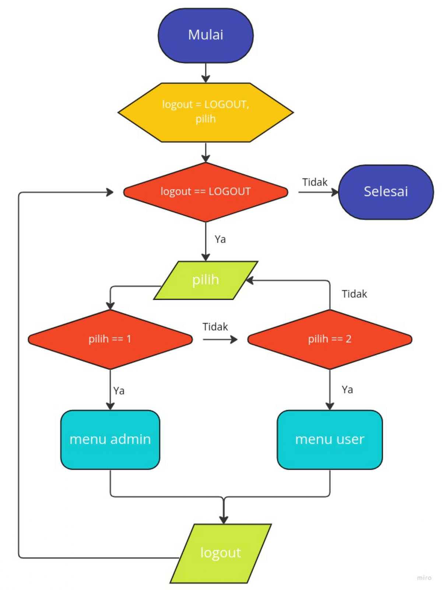

# PromdasQuizMTK

## Flowchart


## Komponen
* [Struct Time](#struct-time)
* Fungsi :
  - [clear](#fungsi-clear)
  - [gettimenow](#fungsi-gettimenow)
  - [toseconds](#fungsi-toseconds)
  - [getpasswd](#fungsi-getpasswd)
  - [read\_line](#fungsi-read_line)
  - [run\_questions](#fungsi-run_questions)
  - [level\_questions](#fungsi-level_questions)
  - [print\_questions](#fungsi-print_questions)
  - [print\_choices](#fungsi-print_choices)
  - [print\_keys](#fungsi-print_keys)
  - [print\_score](#fungsi-print_score)
  - [login](#fungsi-login)
  - [reg](#fungsi-reg)
  - [logout](#fungsi-logout)
  - [menu\_user](#fungsi-menu_user)
  - [menu\_admin](#fungsi-menu_admin)
  - [update\_questions](#fungsi-update_questions)
  - [get\_quetions](#fungsi-get_questions)
  - [get\_data](#fungsi-get_data)
  - [start](#fungsi-start)

## Struct Time
  + Kode :
    ```c
    typedef struct Time {
      int hours;
      int minutes;
      int seconds;
    } Time;
    ```
  + Contoh Implementasi :
    ```c
    Time sekarang;
    sekarang.hours = 13;
    sekarang.minutes = 15;
    sekarang.seconds = 50;

    printf("Sekarang jam %d:%d:%d\n", sekarang.hours, sekarang.minutes, sekarang.seconds);
    ```

## Fungsi clear

  + Kode :
    ```c
    void clear(void) {
      #ifdef _WIN32
        system("cls");
      #else
        system("clear");
      #endif /* _WIN32 */
    }
    ```

  + Contoh Implementasi :
    ```c
    clear();
    ```

## Fungsi gettimenow

  + Kode :
    ```c
    Time gettimenow(void) {
      time_t times = time((time_t*)0);
      struct tm *ttmm = localtime(&times);
      Time result = {
        .hours = ttmm->tm_hour,
        .minutes = ttmm->tm_min,
        .seconds = ttmm->tm_sec,
      };
      return result;
    }
    ```

  + Contoh Implementasi :
    ```c
    Time sekarang = gettimenow();
    printf("Sekarang jam %d:%d:%d\n", sekarang.hours, sekarang.minutes, sekarang.seconds);
    ```
## Fungsi diftime

  + Kode :
    ```c
    Time diftime(Time time_1, Time time_2) {
      Time result = {
        .hours = abs(time_1.hours - time_2.hours),
        .minutes = abs(time_1.minutes - time_2.minutes),
        .seconds = abs(time_1.seconds - time_2.seconds),
      };
      return result;
    }

    ```

  + Contoh Implementasi :
    ```c
    Time time1 = gettimenow();
    printf("Sekarang adalah jam %d:%d:%d\n", time1.hours, time1.minutes, time1.seconds);
    sleep(3);
    Time time2 = gettimenow();
    printf("Lalu sekarang jam %d:%d:%d\n", time2.hours, time2.minutes, time2.seconds);
    Time perbedaan = diftime(time1, time2);
    printf("Perbedaannya adalah %d jam %d menit %d detik\n", perbedaan.hours, perbedaan.minutes, perbedaan.seconds);
    ```


## Fungsi toseconds

  + Kode :
    ```c
    int toseconds(Time time) {
      return time.hours * 3600 + time.minutes * 60 + time.seconds;
    }
    ```
  + Contoh Implementasi :
    ```c
    Time sekarang = gettimenow();
    printf("Sekarang adalah jam %d:%d:%d\n", sekarang.hours, sekarang.minutes, sekarang.seconds);
    printf("Atau dalam detik adalah %d detik\n", toseconds(sekarang));
    ```


## Fungsi getpasswd

  + Kode :
    ```c
    void getpasswd(const char * prompt, char * dest) {
      char pass[100];
      int i = 0;
      char tmp = ' ';
      printf("%s", prompt);
      while(true) {
        if(i != 0 && (tmp == '\n' || tmp == (char)10 || tmp == (char)12 || tmp == (char)13)) break;
        tmp = getch();
        if(tmp != 127 && tmp > 31) {
          printf("*");
          pass[i] = tmp;
          i++;
        } else if(i !=0 && (tmp == '\b' || tmp == (char)127)) {
          int len = strlen(prompt) + i;
          for(int j = 0; j < len; j++) printf("\r");
          for(int j = 0; j < len; j++) printf(" ");
          for(int j = 0; j < len; j++) printf("\r");
          printf("%s", prompt);
          for(int j = 0; j<i-1; j++) printf("*");
          pass[i] = '\0';
          i--;
        }
      }
      printf("\n");
      pass[i] = '\0';
      strcpy(dest, pass);
    }
    ```

  + Contoh Implementasi :
    ```c
    char password[100];
    getpasswd("Masukkan Password: ", password);
    printf("%s\n", password);
    ```


## Fungsi read\_line

  + Kode :
    ```c
    void read_line(char * dest) {
      char c;
      int index = 0;
      dest[index] = '\0';
      while(c = getchar(), c != (char)27) {
        dest[index++] = c;
      }
      dest[index] = '\0';
      printf("\n");
    }
    ```

  + Contoh Implementasi :
    ```c
    char input[1000];
    printf("Tekan Escape lalu enter untuk keluar dari sini!\n");
    read_line(input);
    system("clear");
    printf("%s\n", input);
    ```


## Fungsi run\_questions

  + Kode :
    ```c
    void run_questions(char **questions, char *(*choices)[4], char *keys, int *score, const int len_questions) {
      for(int i = 0; i < len_questions ; i++) {
        if(keys[i]) {
          char input;
          printf("--------------------------------------------------------------------\n");
          printf("| No. %-2d |\n", i + 1);
          printf("----------\n");
          printf("%s\n", questions[i]);
          for(int j = 0; j < 4; j++) {
            printf("%c. %s\n", (char)(j + 97), choices[i][j]);
          }
          printf("--------------------------------------------------------------------\n");
          while (
            printf("=> "), scanf(" %c", &input),
            input = tolower(input),
            input < 97 || input > 100 ) printf("Pilihan anda tidak sesuai!!\n");
          if(input == tolower(keys[i])) (*score)++;
        }
      }
    }
    ```

  + Contoh Implementasi :
    ```c
    int score = 0;
    char *questions[10] = {"Berapa 5 + 5?....", "enam dikali enam sama dengan...."};
    char *choices[10][4] = {{"50", "10", "20", "40"}, {"1", "30", "36", "40"}};
    char keys[10] = {'b', 'c'};
    run_questions(questions, choices, keys, &score, 2);
    printf("score anda : %d\n", score);
    ```


## Fungsi level\_questions

  + Kode :
    ```c
    void level_questions(char *(*questions)[10], char *(*choices)[10][4], char (*keys)[10], int * scores, int * time_plays, const int level) {
      for(int i = 0; i < level ; i++) {
        Time time = gettimenow();
        int score = 0;
        if(keys[i][0]) {
          clear();
          printf("=Level %d============================================================\n", i + 1);
          run_questions(questions[i], choices[i], keys[i], &score, 10);
          scores[i] = score;
          time_plays[i] = toseconds(diftime(gettimenow(), time));
          if(score < 10) break;
        }
      }
    }
    ```

  + Contoh Implementasi :
    ```c
    int scores[] = {0, 0};
    int times[] = {0, 0};
    char *questions[2][10] = {
      {"Berapa 5 + 5?....", "enam dikali enam sama dengan...."},
      {"6 * 5 = ...", "10 * 10 = ...."},
    };

    char *choices[2][10][4] = {
      {{"50", "10", "20", "40"}, {"1", "30", "36", "40"}},
      {{"15", "30", "25", "40"}, {"10", "1", "1000", "100"}},
    };
    char keys[2][10] = {
      {'b', 'c'},
      {'b', 'd'},
    };
    level_questions(questions, choices, keys, scores, times, 2);
    for(int i = 0; i < 2; i++) {
      printf("score %d : %d\n", i + 1, scores[i]);
      printf("time    : %d detik\n", times[i]);
    }
    ```


## Fungsi print\_questions

  + Kode :
    ```c
    void print_questions(char **questions, const int len_questions) {
      for(int i = 0; i < len_questions; i++) {
        if(questions[i])
          printf("%d. %s\n", i + 1, questions[i]);
      }
    }
    ```

  + Contoh Implementasi :
    ```c

    ```


## Fungsi print\_choices

  + Kode :
    ```c
    void print_choices(char **choices, const int len_choices) {
      for(int i = 0; i < len_choices ; i++) {
        if(choices[i][0])
          printf("%c. %s\n", (char)(i + 97), choices[i]);
      }
    }
    ```

  + Contoh Implementasi :
    ```c

    ```


## Fungsi print\_keys

  + Kode :
    ```c
    void print_keys(char *keys, const int len_keys) {
      for(int i = 0; i < len_keys ; i++)
        if(keys[i])
          printf("%d. %c\n", i + 1, keys[i]);
    }
    ```

  + Contoh Implementasi :
    ```c

    ```


## Fungsi print\_score

  + Kode :
    ```c
    void print_score(char *name, char *username, int *score, int *time_plays, const int level) {
      printf("-------------------------------------------------------------\n");
      printf("| Nama     : %-46s |\n", name);
      printf("| Username : %-46s |\n", username);
      printf("| Skor:                                                     |\n");
      for(int i = 0; i < level; i++) {
        printf("| - Level %d: %-2d poin, %3d detik                             |\n", i + 1, score[i], time_plays[i]);
      }
      printf("-------------------------------------------------------------\n");
    }
    ```

  + Contoh Implementasi :
    ```c

    ```


## Fungsi login

  + Kode :
    ```c
    int login(char (*usernames)[100], char (*passwords)[100], int *len_user) {
      char username[100], password[100];
      int pass = -1;
      printf("Username : "); scanf(" %[^\n]s", username);
      for(int i = 0; i < *len_user; i++) {
        if(!strcmp(username, usernames[i])) pass = i;
      }
      if(pass >= 0) {
        while(true) {
          getpasswd("Password : ", password);
          if(!strcmp(passwords[pass], password)) {
            break;
          } else {
            printf("Password Salah!! Coba lagi!!!\n");
          }
        }
      }
      return pass;
    }
    ```

## Fungsi reg

  + Kode :
    ```c
    int reg(char (*usernames)[100], char (*names)[100], char (*passwords)[100], int *len_user) {
      char username[100], name[100];
      printf("Nama : "); scanf(" %[^\n]s", name); strcpy(names[*len_user], name);
      while(true) {
        bool pass = false;
        printf("Username : "); scanf(" %[^\n]s", username);
        for(int i = 0; i < *len_user; i++) {
          if(!strcmp(usernames[i], username)) pass = true;
        }
        if(pass) {
          printf("Username sudah digunakan! Coba yang lain!!\n");
        } else {
          strcpy(usernames[*len_user], username);
          break;
        }
      }
      getpasswd("Password : ", passwords[*len_user]);
      return (*len_user)++;
    }
    ```
## Fungsi logout

  + Kode :
    ```c
    int logout(void) {
      char input[100];
      printf("-------------------------------------------------------------\n");
      printf("k. Kembali\n");
      printf("l. Logout\n");
      printf("-------------------------------------------------------------\n");

      while(
        printf("=> "), scanf(" %[^\n]s", input),
        strcmp(input, "k") && strcmp(input, "l")
      ) printf("Opsi %s tidak ditemukan!!\n", input);

      if(!strcmp(input, "k")) {
        return BACK;
      } else {
        return LOGOUT;
      }
    }
    ```

  + Contoh Implementasi :
    ```c

    ```


## Fungsi menu\_user

  + Kode :
    ```c
    int menu_user(char (*usernames)[100], char (*names)[100], int *len_user, char *(*questions)[10], char *(*choices)[10][4], char (*keys)[10], int (*scores)[3], int (*time_plays)[3], const int level, const int id_user) {
      clear();
      int result;
      char input[100];
      printf("-----------------------DASHBOARD------------------------\n");
      printf("m. Mulai\n");
      printf("k. Kembali\n");
      printf("l. Logout\n");
      printf("--------------------------------------------------------\n");
      while(
        printf("=> "), scanf(" %[^\n]s", input),
        strcmp(input, "m") && strcmp(input, "k") && strcmp(input, "l")
      ) printf("Pilihan anda tidak tepat!!\n");

      if(!strcmp(input, "k")) {
        return BACK;
      } else if(!strcmp(input, "l")) {
        return LOGOUT;
      } else {
        level_questions(questions, choices, keys, scores[id_user], time_plays[id_user], level);
        print_score(names[id_user], usernames[id_user], scores[id_user], time_plays[id_user], level);
        result = logout();
      }
  
      if(result == BACK) {
        return menu_user(usernames, names, len_user, questions, choices, keys, scores, time_plays, level, id_user);
      } else {
        return result;
      }
    }
    ```

  + Contoh Implementasi :
    ```c

    ```


## Fungsi menu\_admin

  + Kode :
    ```c
    int menu_admin(char (*usernames)[100], char (*names)[100], int *len_user, char *(*questions)[10], char *(*choices)[10][4], char (*keys)[10], int (*scores)[], int (*time_plays)[], const int level) {
      clear();
      int input, result;
      char tmp[100];
      printf("------------------------DASHBOARD------------------------\n");
      printf("1. Update Soal dan Kunci Jawaban\n");
      printf("2. Daftar Soal dan Kunci Jawaban\n");
      printf("3. Daftar Pemain\n");
      printf("k. Kembali\n");
      printf("l. Logout\n");
      printf("---------------------------------------------------------\n");
      while(
        printf("=> "), scanf(" %[^\n]s", tmp), input = atoi(tmp),
        strcmp(tmp, "k") && strcmp(tmp, "l") && (input < 1 || input > 3)
      ) printf("Pilihan anda tidak tepat!!\n");

      if(!strcmp(tmp, "k")) {
        return BACK;
      } else if(!strcmp(tmp, "l")) {
        return LOGOUT;
      }

      if(input == 1) {
        result = update_question(questions, choices, keys, scores, time_plays, level);
      } else if(input == 2) {
        result = get_question(questions, choices, keys, level);
      } else {
        result = get_data(usernames, names, len_user, scores, time_plays, level);
      }

      if(result == BACK) {
        return menu_admin(usernames, names, len_user, questions, choices, keys, scores, time_plays, level);
      } else {
        return result;
      }
    }
    ```

  + Contoh Implementasi :
    ```c

    ```


## Fungsi update\_questions

  + Kode :
    ```c
    int update_question(char *(*questions)[10], char *(*choices)[10][4], char (*keys)[10], int (*scores)[], int (*time_plays)[], const int level) {
      int types, input, num;
      char tmp[100];
      clear();
      printf("---------------------------------------------------------\n");
      printf("1. Edit Soal\n");
      printf("2. Kunci Jawaban\n");
      printf("---------------------------------------------------------\n");
      printf("k. Kembali\n");
      printf("l. Logout\n");
      printf("---------------------------------------------------------\n");
      while(
        printf("=> "), scanf(" %[^\n]s", tmp), types = atoi(tmp),
        strcmp(tmp, "k") && strcmp(tmp, "l") && types != 1 && types != 2
      ) printf("Pilihan anda tidak tepat!\n");

      if(!strcmp(tmp, "l")) {
        return LOGOUT;
      } else if(!strcmp(tmp, "k")) {
        return BACK;
      }
    back:
      clear();
      printf("---------------------------------------------------------\n");
      for(int i = 1; i <= level; i++)
        printf("%d. Level %d\n", i, i);
      printf("---------------------------------------------------------\n");
      printf("k. Kembali\n");
      printf("l. Logout\n");
      printf("---------------------------------------------------------\n");
      while(
        printf("=> "), scanf(" %s", tmp), input = atoi(tmp),
        strcmp(tmp, "k") && strcmp(tmp, "l") && (input < 1 || input > level)
      ) printf("Pilihan anda tidak tepat!\n");

      if(!strcmp(tmp, "l")) {
        return LOGOUT;
      } else if(!strcmp(tmp, "k")) {
        return update_question(questions, choices, keys, scores, time_plays, level);
      }
  
      clear();
      printf("==========================Level %d============================\n", input);
      if(types == 1) {
        char input3[100];
        print_questions(questions[input-1], 10);
        printf("---------------------------------------------------------\n");
        printf("k. Kembali\n");
        printf("l. Logout\n");
        printf("---------------------------------------------------------\n");

        while(
          printf("=> "), scanf(" %[^\n]s", tmp), num = atoi(tmp),
          (num < 1 || num > 10) && strcmp(tmp, "k") && strcmp(tmp, "l")
        ) printf("Pilih dari Nomor 1 hingga 10! atau k untuk kembali dan l untuk logout\n");
    
        if(!strcmp(tmp, "l")) {
          return LOGOUT;
        } else if(!strcmp(tmp, "k")) {
          goto back;
        }

        while(true) {
          clear();
          char yn;
          while(
            printf("%s\n", questions[input-1][num - 1]),
            printf("Edit? (y/n)\n=> "), scanf(" %c", &yn),
            tolower(yn) != 'y' && tolower(yn) != 'n'
          ) printf("Pilihan anda salah\n");

          if(tolower(yn) == 'y') {
           clear();
          } else {
            break;
          }

          printf("%s\n", questions[input-1][num - 1]);
          printf("--------------------------------------------------------------\n");
          printf("Tekan Escape lalu enter untuk save dan keluar!\n");
          printf("--------------------------------------------------------------\n");
          questions[input-1][num - 1] = (char *)(malloc(500 * sizeof(char)));
          read_line(questions[input-1][num - 1]);
          questions[input-1][num - 1][0] = ' ';
          clear();
          printf("%s\n", questions[input-1][num - 1]);
          while(
            printf("Apakah sudah benar ? (y/n)\n=> "), scanf(" %[^\n]s", input3),
            strcmp(input3, "y") && strcmp(input3, "Y") && strcmp(input3, "n") && strcmp(input3, "N")
          ) printf("Pilihan anda kurang tepat");
          if(!strcmp(input3, "Y") || !strcmp(input3, "y")) break; 
        }
        while(true) {
          clear();
          print_choices(choices[input-1][num - 1], 4);
          while(
            printf("Edit? (y/n) => "), scanf(" %[^\n]s", input3),
            strcmp(input3, "Y") && strcmp(input3, "y") && strcmp(input3, "n") && strcmp(input3, "N")
          ) printf("Pilihan anda kurang tepat!\n");

          if(!strcmp(input3, "Y") || !strcmp(input3, "y")) {
            char input4;
            while(
              printf("Pilih yang ingin di edit [a-d]\n=> "), scanf(" %c", &input4),
              input4 < 'a' || input4 > 'd'
            ) printf("Anda salah memasukkan pilihan!\n");
            printf("[%s] => ", choices[input - 1][num - 1][input4-97]);
            choices[input-1][num - 1][input4 - 97] = (char *)(malloc(100 * sizeof(char)));
            scanf(" %[^\n]s", choices[input - 1][num - 1][input4-97]);
          } else {
            goto back;
          }
        }
      } else {
        int input2;
        while(true) {
          char ch;
          print_keys(keys[input-1], 10);
          printf("---------------------------------------------------------\n");
          printf("k. Kembali\n");
          printf("l. Logout\n");
          printf("---------------------------------------------------------\n");

          while(
            printf("=> "), scanf(" %[^\n]s", tmp), input2 = atoi(tmp),
            (input2 < 1 || input2 > 10) && strcmp(tmp, "k") && strcmp(tmp, "l")
          ) printf("Pilihan anda salah!\n");

          if(!strcmp(tmp, "l")) {
            return LOGOUT;
          } else if(!strcmp(tmp, "k")) {
            goto back;
          }
          while(
            printf("[a-d] => "), scanf(" %c", &ch), ch = tolower(ch),
            ch < 'a' || ch > 'd'
          ) printf("Anda salah Memasukkan Jawaban!\n");
          keys[input-1][input2-1] = ch;
        }
      }
    }
    ```

  + Contoh Implementasi :
    ```c

    ```


## Fungsi get\_questions

  + Kode :
    ```c
    int get_question(char *(*questions)[10], char *(*choices)[10][4], char (*keys)[10], const int level) {
      int input, types, result;
      char tmp[100];
      clear();
      printf("---------------------------------------------------------\n");
      printf("1. Daftar Soal\n");
      printf("2. Daftar Pilihan Ganda\n");
      printf("3. Kunci Jawaban\n");
      printf("---------------------------------------------------------\n");
      printf("k. Kembali\n");
      printf("l. Logout\n");
      printf("---------------------------------------------------------\n");
      while(
        printf("=> "), scanf(" %[^\n]s", tmp), types = atoi(tmp),
        (types < 1 || types > 3) && strcmp(tmp, "k") && strcmp(tmp, "l")
      ) printf("Pilihan anda tidak tepat!\n");

      if(!strcmp(tmp, "l")) {
        return LOGOUT;
      } else if(!strcmp(tmp, "k")) {
        return BACK;
      }

    back:
      clear();
      printf("---------------------------------------------------------\n");
      for(int i = 1; i <= level; i++)
        printf("%d. Level %d\n", i, i);
      printf("---------------------------------------------------------\n");
      printf("k. Kembali\n");
      printf("l. Logout\n");
      printf("---------------------------------------------------------\n");
      while(
        printf("=> "), scanf(" %s", tmp), input = atoi(tmp),
        strcmp(tmp, "k") && strcmp(tmp, "l") && (input < 1 || input > level)
      ) printf("Pilihan anda tidak tepat!\n");

      if(!strcmp(tmp, "l")) {
        return LOGOUT;
      } else if(!strcmp(tmp, "k")) {
        return get_question(questions, choices, keys, level);
      }

      clear();
      printf("==========================Level %d============================\n", input);
      if(types == 1) {
        print_questions(questions[input - 1], 10);
      } else if(types == 2) {
        for(int i = 0; i < 10; i ++) {
          printf("-------------------------------------------------------------\n");
          printf("| No. %-2d |\n", i + 1);
          printf("----------\n");
          print_choices(choices[input - 1][i], 4);
          printf("-------------------------------------------------------------\n");
        }
      } else {
        print_keys(keys[input - 1], 10);
      }
      printf("-------------------------------------------------------------\n");
      result = logout();

      if(result == BACK) {
        goto back;
      } else {
        return result;
      }
    }
    ```

  + Contoh Implementasi :
    ```c

    ```
## Fungsi get\_data

  + Kode :
    ```c
    int get_data(char (*usernames)[100], char (*names)[100], int *len_user, int (*scores)[3], int (*time_plays)[3], const int level) {
      clear();
      for(int i = 0; i < *len_user; i++) 
        print_score(names[i], usernames[i], scores[i], time_plays[i], level);
      return logout();
    }
    ```

  + Contoh Implementasi :
    ```c

    ```


## Fungsi start

  Kode :
  ```c
  int start(char (*username_admins)[100], char (*name_admins)[100], char (*password_admins)[100], int *len_admins, char (*username_users)[100], char (*name_users)[100], char (*password_users)[100], int *len_users, char *(*questions)[10], char *(*choices)[10][4], char (*keys)[10], int (*scores)[], int (*time_plays)[], const int level) {
      int input, id, is_admin = 0, result;
      char tmp[100];
      clear();
      printf("-------------------------HOMEPAGE-----------------------\n");
      printf("1. Admin\n");
      printf("2. User\n");
      printf("--------------------------------------------------------\n");
  
      while(
        printf("=> "), scanf(" %[^\n]s", tmp), input = atoi(tmp),
        input != 1 && input != 2
      ) printf("Pilihan anda kurang tepat!!\n");
      if(input == 1) {
        is_admin = 1;
      }

    back:
      clear();
      printf("------------------------%s---------------------------\n", is_admin ? "-ADMIN" : "-USER-");
      printf("1. Register\n");
      printf("2. Login\n");
      printf("---------------------------------------------------------\n");
      printf("k. Kembali\n");
      printf("l. Logout\n");
      printf("---------------------------------------------------------\n");
      while(
        printf("=> "), scanf(" %[^\n]s", tmp), input = atoi(tmp),
        input != 1 && input != 2 && strcmp(tmp, "k") && strcmp(tmp, "l")
      ) printf("Pilihan anda kurang tepat!!\n");

      if(!strcmp(tmp, "k")) {
        return start(username_admins, name_admins, password_admins, len_admins, username_users, name_users, password_users, len_users, questions, choices, keys, scores, time_plays, level);
      } else if(!strcmp(tmp, "l")) {
        return LOGOUT;
      }

    if(input == 1) {
        if(is_admin) {
          id = reg(username_admins, name_admins, password_admins, len_admins);
        } else {
          id = reg(username_users, name_users, password_users, len_users);
        }
      } else {
        if(is_admin) {
          while(
            id = login(username_admins, password_admins, len_admins),
            id < 0
          ) printf("Username tidak ditemukan! Coba lagi\n");
        } else {
          while (
            id = login(username_users, password_users, len_users),
            id < 0
          ) printf("Username tidak ditemukan! Coba lagi\n");
        }
      }

      if(is_admin) {
        result = menu_admin(username_users, name_users, len_users, questions, choices, keys, scores, time_plays, level);
      } else {
        result = menu_user(username_users, name_users, len_users, questions, choices, keys, scores, time_plays, level, id);
      }

      if(result == BACK) {
        goto back;
      } else {
        return result;
      }
    }
  ```

